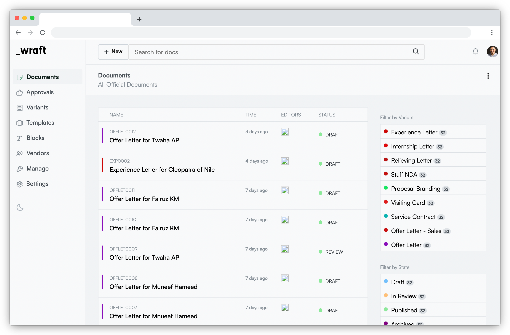

<p align="center">
  
</p>

<h3 align="center">
  <a href="https://wraft.co">wraft.co</a>
</h3>

<p align="center">
  <i>The open-source Contract Lifecycle Management platform.</i>
</p>

<p align="center">
  <a href="https://documen.so/discord">
    
  </a>
  <a href="https://github.com/documenso/documenso/blob/main/LICENSE">
    
  </a>
</p>

<div align="center">
  
</div>

---

# 📝 Wraft - Contract Lifecycle Management

**Wraft** is a comprehensive open-source platform for managing contracts and documents through their lifecycle. It helps users simplify, streamline, and automate document creation, processing, approval, and signing.

## ✨ Features

- **Document Creation**: Generate documents quickly and easily using customizable templates.
- **High-Volume Automation**: Support for high-volume document creation via automated pipelines.
- **Secure E-Signatures**: Get documents signed securely online, compliant with international standards.
- **Customizable Workflows**: Design approval workflows that fit your organization’s processes.
- **Compliance and Security**: Built with strong security features and compliance in mind.

---

## 🌟 About Wraft

Wraft focuses on efficiency, security, and flexibility, making it ideal for businesses and individuals who want to modernize their document-related processes. Whether you're managing contracts, agreements, or any official documentation, Wraft provides a seamless solution from start to finish.

---

## ⚙️ Prerequisites

To run **wraft.co**, you’ll need:

- **Node.js** (Version: >=18.x)
- **pnpm** (Version: >=8.x)

---

## 🚀 Getting Started

### 1. Clone the repository

Fork or clone the repository from [GitHub](https://github.com/wraft/wraft).

```sh
git clone https://github.com/wraft/wraft.git
```

2. Navigate to the project folder

```sh
cd wraft
```

3. Install the dependencies

```sh
pnpm i
```

4. Set up environment variables

```sh
cp apps/web/.env.example .env
```

5. Build all packages

```sh
 pnpm run build
```

6. Start the development server

```sh
 pnpm run dev
```
