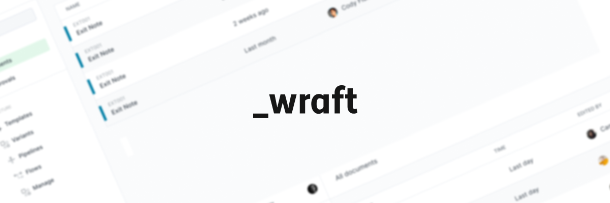
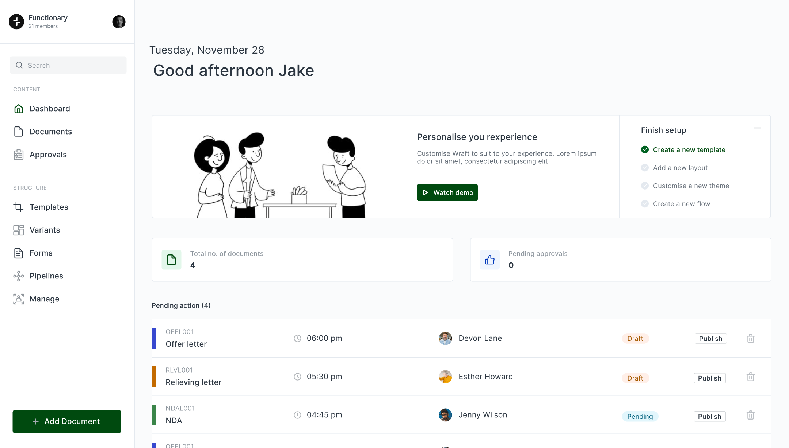

<p align="center">
  
</p>

<h1 align="center">
  <a href="https://wraft.co">wraft.app</a>
</h1>

<p align="center">
  <i>The open-source Document Lifecycle Management platform.</i>
</p>

<div align="center">
  
</div>

---

# 📝 Wraft - Document Lifecycle Management

**Wraft** is a comprehensive open-source platform for managing contracts and documents through their lifecycle. It helps users simplify, streamline, and automate document creation, processing, approval, and signing.

## 🌟 About Wraft

Wraft focuses on efficiency, security, and flexibility, making it ideal for businesses and individuals who want to modernize their document-related processes. Whether you're managing contracts, agreements, or any official documentation, Wraft provides a seamless solution from start to finish.

---

## ⚙️ Prerequisites

To run **wraft.co**, you’ll need:

- **Node.js** (Version: >=18.x)
- **pnpm** (Version: >=8.x)

---

## 🚀 Getting Started

#### 1. Clone the repository

Fork or clone the repository from [GitHub](https://github.com/wraft/wraft).

```sh
git clone https://github.com/wraft/wraft-frontend.git
```

#### 2. Navigate to the project folder

```sh
cd wraft-frontend
```

#### 3. Install the dependencies

Make sure you have pnpm installed, then install all the project dependencies.

```sh
pnpm i
```

#### 4. Set up environment variables

Copy the .env.example file to .env inside the apps/web directory.

```sh
cd apps/web
cp .env.example .env
cd ../..
```

#### 5. Build all packages

Run the following command to build all packages.

```sh
 pnpm run build
```

#### 6. Start the development server

After building, run the application in development mode.

```sh
 pnpm run dev
```

The app should now be running locally, and you can access it at http://localhost:3000.

## 📄 License

Wraft is open-source software licensed under the [AGPLv3](LICENSE).
